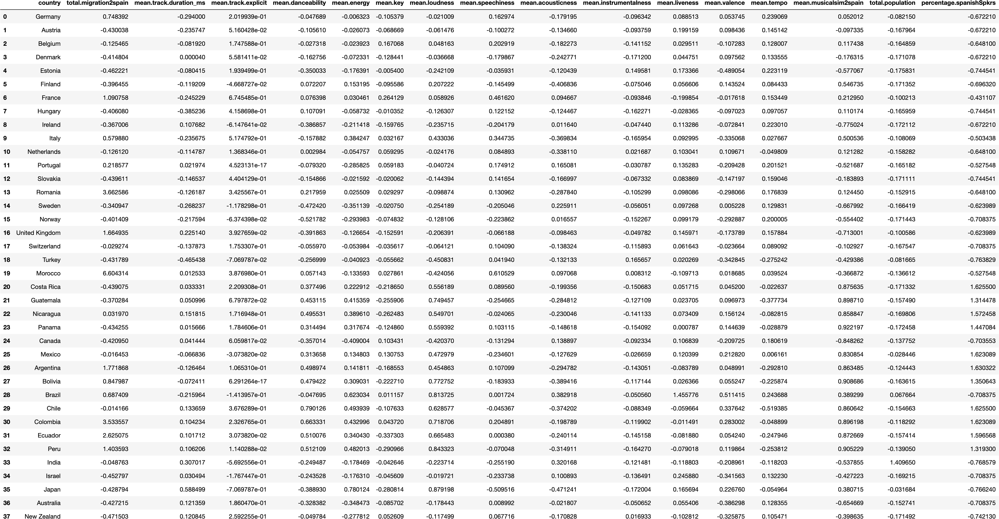
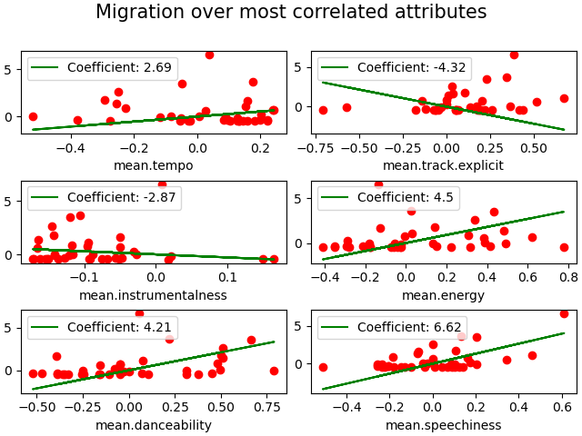

\[\]

# Introduction

Music is recognized as integral to culture, with evidence of musical
activity dating back to humanities earliest days. In both it's origins
and today, it also finds itself inextricably tied to the movement of
people and the musical traditions they bring with them. While it is
believed that this relationship is reciprocal, and that music taste is a
cultural element that feeds into the motivation behind migration, what
specific elements of musical \"style\" play a part in this process
remains to be explored. The purpose of this study is to examine this
relationship through the lens of data analysis. By comparing the
characteristics of the music most listened to by different countries in
relation to the migration statistics of these countries, it aims to
identify which are statistically most correlated with migratory choice.

# Background

## Migration

Many factors influence migration, including economic, political, social
and environmental considerations. According to the @ida_2019, economic
factors such as employment opportunities, wage differences and
inequality drive migration. Political factors can also lead to
individuals leaving their home in search of safety and security.
Resource scarcity, natural disasters, and other environmental conditions
also contribute to this decision.\
\
Culture can also play a significant role in shaping migratory patterns.
When it comes to voluntary migration, this can be factors such as
language, religion and social norms, in addition to the cultural
expectations of the destination [@huston_2020].

## Music and Culture

Throughout history, music has played a part in ceremonies and social
gatherings, but also revolts and protests. It continues to be studied in
it's relation to contemporary politics and society [@lusoMusic].\
\
A nations shared musical tradition feeds into it's citizens national and
individual identities [@epstein_2010]. While migration is generally
understood as an economic phenomenon, ethnomusicologists have explored
how a nations culture affects the decisions made by it's people when
they move abroad. Culture has been observed through shared beliefs,
customs, values and attitudes, but music is given little to no
consideration.

## Music Streaming

In recent decades, with the boom of online music sharing, torrenting and
now streaming, more people than ever have immediate access to upwards of
80 million tracks [@peoples_2022]. With the digitisation of music
consumption, it is also easier than ever to track what the people of a
nation are playing on repeat. Curated national playlists, such as
Spotify's weekly \"Top 50's\" can help track trends in not only the
music industry, but in a nation's broader preferences in popular music.\
\
Another consequence of the digitisation of music is the development of
more practical ways to describe music. While musicians often use written
forms of music, such as tab or sheet music, in the field of
neural-creativity, researchers settle for encodings such as MIDI
[@groove2groove]. These methods come with limitations, however, as
without a robust set of meta-data, two identical representations are not
assured to be musically similar in a way a human may recognize. The
streaming industry has instead developed a series of abstract musical
features that better lend themselves to being used in recommender
systems. Given that these are feed-back systems, wherein a user's
experience with the results provides data on which to learn, these
features are a robust way to determine how similarly two songs will be
perceived by us as being [@robley_2022].

# Motivation

There is a lack of enquiry as to what about a countries music makes
someone more inclined to move there. This report seeks to shine a light
on this question through the lens of data analytics, with a focus on the
emigrants to Spain from around the world. Being a Spanish native as
influenced this decision. However, Spain is also positioned as
noteworthy in this line of questioning for it's vast global cultural,
economic and political ties. For one it is a former colonial-empire that
administrated vast swathes of land in Africa, America and Asia, and
brought to these places through the slave and commodity trade what is
now one of the most spoken languages in the world. It is also a Schengen
member state, meaning most European citizens have the right to move to
and work in Spain without the need for additional Visas. Finally, it has
one of the highest net-migration rates in Europe (that is difference
between immigrants and emigrants) [@em_ine_2021] so migration data is
plentiful and of easy access.

# Initial Proposal

This project began with the objective of identifying a similarity metric
for a playlist of songs. If the \"Top 50\" playlists for two countries
render a high similarity metric, this would indicate that the two
countries share some semblance of taste in popular music. This metric
would then be calculated for every country from which people emigrate to
Spain to. Any correlation between this metric and a given country's
total emigration numbers to Spain would suggest that taste in music (or
overall musical similarity) influences where someone chooses to migrate
to. Other national statistics, such as population and percentage of
Spanish speakers would be taken into account as rough stand-ins for
other cultural and economic reasons for migration. The correlation of
these features with total emigration would act as a benchmark for the
above mentioned metric.

# Collecting Data

All data collected is available publicly and its use did not require the
acceptance of additional terms of conditions beyond those required to
access the data.

## Spotify

As previously mentioned, Spotify maintains numerous \"currated\"
playlists, some of which are generated on the basis of popular listening
data from geographic regions. This includes the \"Top 50\" national
playlists.\
\
Collecting data from Spotify involves the use of the Developer API that
allows for the extraction of user listening data, playlist meta data
and, importantly, musical meta data. This latter information is what is
used to determine the musical similarity of two tracks, which along with
meta-data similarity, contributes to a recommendation being generated.
Data scraping from Spotify's API is subject to their terms of service
that outlines the correct uses for said data.\
\
For the purposes of this project, three CSV files were sampled from a
publicly available repository on Kaggle [@bwandwando_2022]. It queries a
variety of both official and unofficial \"Top 50\" national playlists
every day over the course of a month. Data is stored in three CSV files.

### Playlist Metadata

At only around 300kb, it stores information about the playlists sampled,
including the owner, the data created, the total listeners, description
and name.

### Playlist Track Metadata

This dataset is around 4mb. For every time a song was extracted from a
playlist over the course of a month, there is an entry on this table. It
includes attributes such as track popularity, the track name, the
playlist it was extracted from, and when it was added to and read from
the playlist.

### Track Metadata

This dataset is around 10mb. This table contains a more complete set of
characteristics for every song that has been read from any given
playlist. This means there is only one entry per song. The
characteristics that are of interest include some related to
meta-similarity:

-   The artists on each song.

-   The markets on which the song is available.

-   The album the song belongs to.

-   Track duration.

-   Track explicitness.

Aswell as some related to musical similarity:

-   \"Danceability\".

-   \"Energy\".

-   \"Speechiness\".

-   \"Accousticness\".

-   \"Instrumentalness\".

-   \"Liveness\".

-   Valence.

-   Tempo.

-   Key.

-   Loudness.

Of note is that while some of these are features are used in formal
music theory, others are more broader terms for musical style that best
capture what it is people like about a given song.

## Spanish Emigration Statistics

The National Institute for Statistics (INE in Castilian Spanish) is
responsible for the accumulation and storage of various nation-wide
data, as well as for facilitating access to this data. The Migration
Statistics (EM) department surveys all legal migration into and out of
Spain by continent and country. The dataset used was constructed from
data available on the INE website `ine.es`, last updated in 2021.

## Spanish Language Statistics

The data on the total number of Spanish language speakers in each
country, and total population of that country was scraped from the
Wikipedia article on the @wikipedia_2023. It cites numerous sources for
both of these values. It serves as a rough indicator of how common
Spanish speaking is in the countries of interest.

# Cleaning Data

Every dataset required at least some cleaning in order to prepare it for
use in data analysis routines. Cleaning took the form of, firstly,
removing all unwanted or unnecessary attributes. This was mainly done in
the Spotify CSV files, as included in every song and playlist meta-data
entry is information corresponding to artwork, URLs and access URIs.
Given that these values are unique to every song (or every release of a
song, given that some songs appeared as both singles and as one track in
an album), they can be considered neither categorical nor nominal and so
do not serve for statistical analysis.\
\
Similarly, more pertinent information (such as song artists) was stored,
by default, as a JSON string containing the name of the artist, but also
meta-data relating to them. This unnecessary information was dropped
from the table entries leaving cleaned data.\
\
A functional limitation of Python (the language used to conduct
analysis) necessitated further cleaning of individual entry features.
Because of how CSV variables are read into Pandas `DataFrames`, artist
names or song titles with apostrophes or quotation marks would interfere
with the function of the parser.\
\
The Spanish language dataset was missing the total population values for
some countries. One additional step that had to be taken to allow for
it's use was to manually enter the missing values, to allow for the
calculation of the percentage of Spanish speakers.\
\
There were some cases where entries were missing or had null attribute
values, and where the correct value could not be either found elsewhere
or gleaned from another entry. In such cases the entry was discarded.

# Combining Data

Once the data had been cleaned, the following pre-processing routines
were followed to normalise and prepare the data for combination and
subsequent analysis.

## Pre-Processing

### Spotify Data

After extracting the playlist track meta-data and the track meta-data,
we choose a subset of attributes to consider when finding similarity.
These are the above mentioned musical-attributes with the addition of
the meta-attributes for track duration and track explicitness. These
(and subsequent attributes of interest) are mean-normalized:
$$\text{normalize}(\text{value})=\frac{\text{value}-\text{mean}}{\text{standard deviation}}$$
To determine the similarity between two playlists, firstly all the songs
belonging to a playlist must be extracted. This is achieved by joining
the `playlist track meta-data` with the `track meta-data` on the track
ID attribute. Because there can be various entries for one song in the
same playlist (one entry for every time the song is read), we further
reduce it to one entry per song with an additional `times_added`
attribute.\
\
To determine the similarity between two playlists, firstly the mean
values for the attributes of interest are calculated. Cosine distance is
then used to determine how similar the two sets of average music
characteristics are:
$$\text{cosine similarity}(A, B):=\frac{\sum_{i=1}^n A_i B_i}{\sqrt{\sum_{i=1}^n A_i^2} \sqrt{\sum_{i=1}^n B_i^2}}$$
Given the above routine, the similarity between every country's \"Top
50\" playlist with Spain's is calculated and stored (along with their
mean musical attributes) as an attribute to every country's playlist.

### Emigration Data

The pre-processing here is minimal. Given that, during cleaning, all
invalid or nonessential entries have been removed (notably those that
indicate the emigration numbers for wider regions and continents), the
only pre-processing done is mean-normalisation.

### Language Data

From this language data we want to extract both the total number of
inhabitants per country and the percentage of of residents who speak
Spanish. The latter is calculated by dividing the total number of
Spanish speakers (including limited competence speakers) and divide it
by the total population. As above, these values are then
mean-normalised.

## Merging Data

Once all datasets have been pre-processed, they are merged with an inner
join on the `country` attribute. The resulting dataset has 37 columns
and 17 rows (see fig. 2).

# Observations

## Outliers

Given that the stated goal is to examine how overall musical similarity
affects emigration, a simple linear regression model is run on the
constructed data. The resulting coefficient is $\aprox -3.25$,
indicating that while there is some correlation it seems to be a
negative correlation, which might indicate that the initial hypothesis
is incorrect. However, visualising this plot reveals that the this
negative correlation stems from Morocco, an substantial outlier that has
the highest emigration rate to Spain but is below average with regards
to similarity (see fig 2).

While certainly this would indicate that musical similarity is not the
*most* correlated attribute to the target, it also does not suggest that
it is unimportant. The other two outliers correspond to the UK and
Romania (left-most to right-most respectively). Some outliers were to be
expected because, as mentioned above, there are many factors that
motivate migration. In the case of Morocco, close borders and centuries
of overlapping history and reciprocal migration likely overcome any
musical differences. Spanish-Romanian diplomatic relations have likewise
persisted for over 135 years, throughout which both have amassed
numerous bilateral agreements [@spain_info]. Spain currently ranks 10th
for foreign investment in Romania [@lamoncloa_2022] and Romania is set
to join the Schengen zone soon.\
\
While there are reasons for there to be outliers, their presence
indicates that the similarity metric being used was either insufficient
or incomplete.

## Most Correlated Attributes

To overcome this issue, a multiple-linear regression model was trained
on the full dataset (excluding the country and target attributes). The
result of this procedure is an array of coefficients or weights that are
applied to the value of each attribute before using it's value (along
with the others) to predict the target. Coefficients that are closer to
0 show fewer signs of correlation, while those with larger magnitudes
indicate either positive or negative correlation (see fig 4). For
ease of analysis, the best six coefficients are picked (those with the
highest value aside from the musical similarity attribute).

Here we see that our regression lines seem to be more resilient to
outliers, and that most of them fit the scatter plots. The most
positively correlated attributes `speechiness`, `danceability` and
`energy` are attributes characteristically attributed to Reggaeton, a
genre of Caribbean and Latin-American origin that is typically regarded
as one of the most popular forms of dance music both within and without
the Spanish speaking world [@pineda_2022].\
\
The negatively correlated attributes are `instrumentalness` and
`explicitness` and seem to suggest that Spain attracts fans of more
synthetic or synthesized music with less swearing. Conducting visual
analysis on the plots indicates however that outliers seem to affect
`explicitness` more. This is because mean explicitness is backward
skewed, and most playlists feature above average explicitness.

# Conclusions

We can conclude from this analysis that there is some degree of
correlation between the average musical-style attributes of Spotify
\"Top 50\" playlists and the decision to migrate to Spain. Furthermore,
most of the attributes originating from the Spotify data outperform
those relating to either total population or the percentage of Spanish
speakers per country, indicating that correlations found are robust and
are not simply due to skewed data.\
\
Not all attributes seem to be equally important, however, and those that
are would be pertinent to most forms of dance music, in particular
Spanish dance music; energy, danceability and speechiness. This might
suggest that dance music (and more-so the kind of dance music someone
can listen to) in a place plays a part in a persons decision to
emigrate. This conclusion would be supported by the literature as dance
music is often enjoyed communally in social gatherings such as those
traditionally treated as culturally significant when discussing
migration.

## Limitations

Because of where some data (in particular the Spotify data) was sourced
from, there were numerous formatting and compatibility errors associated
with the raw data files. This required lengthy cleaning and
re-formatting to allow for use with Pandas. Furthermore, this research's
scope is limited by looking specifically at Spain, and at a period of 1
year. Ideally access to other streaming services \"Top 50\" equivalent
playlists would have been used to compare and contrast the results
provided by Spotify's, however as most of these are either
premium-services or do not have robust API support I was limited to only
one demographics perspective. Many Apple users use Apple Music
exclusively, and while there is no guarantee that Apple's playlist data
would have been any different to Spotify's it would have added another
level of reliability to the analysis conducted. This being one academic
endeavour of many that a student must undergo has also meant that there
was a limited amount of time that could be dedicated to this research.

## Future Work

Further experimentation with the style-similarity metric could still
prove the initial hypothesis of similarity being ultimately correlated
to emigration totals. Other similarity metrics such as Jaccard or
Manhattan could be tested. Additional song attributes (particularly
additional meta-attributes) could be taken into account, or even used to
determine a secondary meta-similarity score that could be used in
conjunction to the musical similarity for finding a line of best fit.
Furthermore other regression types could be investigated, as linear
regressions did not perfectly capture the relationship between some of
these attributes and migration, and alternative regression types might
render far more closer fitting lines.

# References

